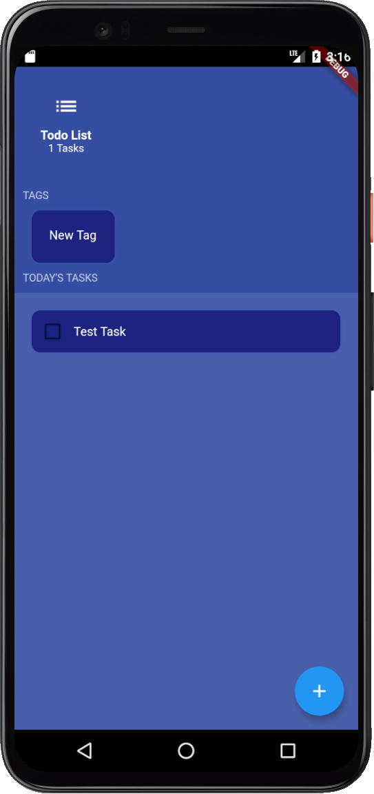
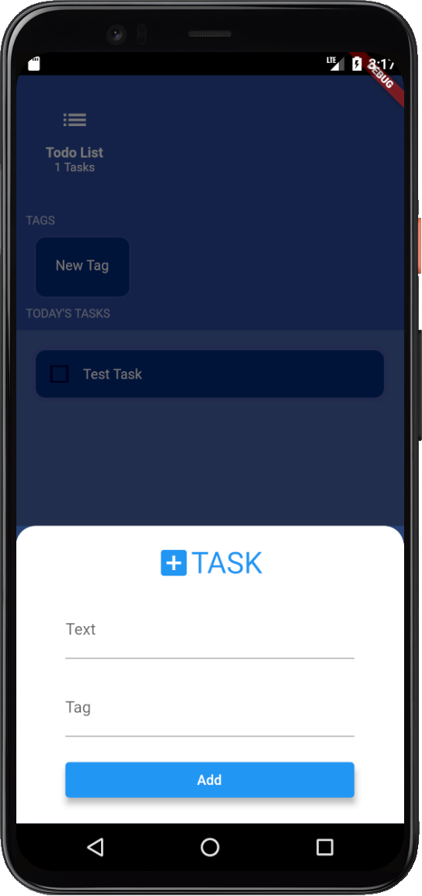
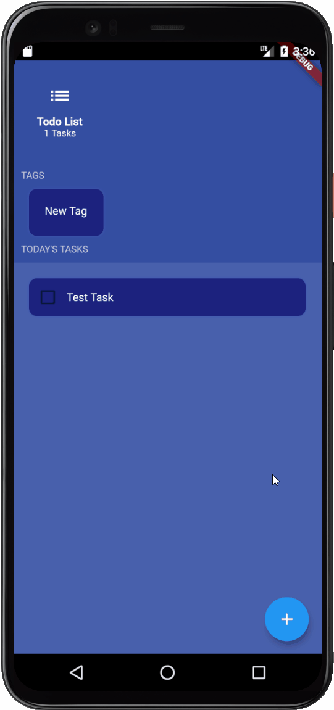

# ToDo List
> ## 사용 패키지
* Sqlite
* provider

> ## 설명
심플한 디자인에 Sqlite를 활용한 ToDo App

- [X] 추가 : 하단 버튼을 통해 Task 추가
- [X] 삭제 : 해당 Task 길게 누르면 삭제

> ## 화면 구성
|            메인화면            |           추가화면            |            실행화면            |
| :----------------------------: | :---------------------------: | :----------------------------: |
|  |  |  |

